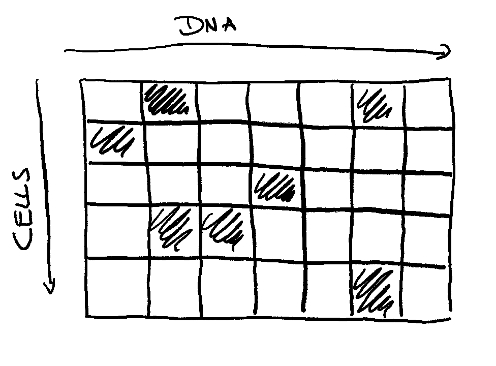

# JMAK Model to Find the Relationship Between Cellular Properties and DNA Repair

## Introduction
The genome, as the hereditary unit of life, is constantly under threat to be altered by genotoxic
agents and even the cell’s own metabolism. Repair mechanisms are therefore essential to ensure
DNA integrity and to enable life itself. One of the best studied DNA repair mechanisms is the
nucleotide excision repair (NER) pathway, which is the only method that can remove UV-induced
cyclobutane pyrimidine dimers (CPDs) in higher eukaryotes. *In vitro* experiments revealed the
existence of two different lesion recognition mechanisms. The first one is coupled to transcription
(transcription-coupled repair, TCR) and is thus only available at genes. The other act genome-wide
(global-genome wide repair, GGR). After the initial recognition of the DNA break, the excision and
replacement behaviour is the same in both GGR and TCR. Despite the fact that these subpathways
are similar, they are usually related to different efficiency and speed. The scientific community,
however, has not reached yet a consensus what biological properties contribute to these different
dynamics.

This project aims to explain the removal of CPD lesion in yeast cells over time. It makes use of the
JMAK model which describes the phase shift of solids and the fraction of transformed particles by 
exploiting the expansion of patterns. The found parameters can be linked to real biological features.

## Requirements and Installation
The code requires `python3.8` if plotting is used. Otherwise any other python version >=3 should work.
It is recommended to have `pip` installed to deploy the necessary requirements. Once done, run

```commandline
python3.8 -m pip install -r requirements.txt
```

## Linking JMAK to CPD Data
We assume that the CPD-seq data aggregates the information over a whole cell culture. The
remaining fraction of unrepaired lesions and the possibility of finding it is hence dependent on
both, how many lesions were repaired in a single cell and how many cells have DNA damage
remaining at this locus. This can be understood as being organised in a two-dimensional grid, with
one dimension representing the loci in the DNA and the other with the cells in the culture. It
is intuitive to presume that repair is independent between cells. We furthermore conjecture that
lesion removal is also independent within the cell. This means that the repair process at locus x
does not influence the repair at locus y. We re-arrange the repaired regions such that they create
patterns.




This permits us to describe the fraction of repaired lesions with the Johnson–Mehl–Avrami–
Kolmogorov (JMAK or any permutation of these letters in the following). The JKMA model
describes the phase change of solids. Here, transformation from phase 1 to phase 2 happens through
the spherical growth of particles. This can be understood as the expansion of our patterns. This
growth happens at a constant rate v. This is the expansion of the repair pattern over time. If the
surface of our pattern is in a two-dimensional space and perfectly round, the area s of the surface
is proportional to the square of the speed v, ie. s  v 2 . We introduce a constant k such that
s = kv 2 . The fraction oft transformed particles f (repaired lesions over all initial damages) is then
only dependent on the expansion speed v and the remaining number of unrepaired lesions n. For a further
description see [the material provided by the University of Utah](https://my.eng.utah.edu/~lzang/images/lecture-15.pdf).