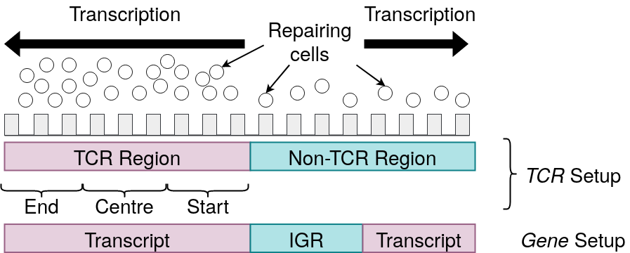

# KJMA Model to Find the Relationship Between Cellular Properties and DNA Repair

## Introduction
The great advances of sequencing technologies allow the *in vivo* measurement of nuclear processes---such as DNA repair 
after UV exposure---over entire cell populations. However, data sets usually contain only a few samples over several 
hours, missing possibly important information in between time points. We developed a data-driven approach to analyse CPD
repair kinetics over time in *Saccharomyces cerevisiae*. In contrast to other studies that consider sequencing signals 
as an average behaviour, we understand them as the superposition of signals from independent cells. By motivating repair
as a stochastic process, we derive a minimal model for which the parameters can be conveniently estimated. We correlate 
repair parameters to a variety of genomic features that are assumed to influence repair, including transcription rate 
and nucleosome density. The clearest link was found for the transcription unit length, which has been unreported for 
budding yeast to our knowledge. The framework hence allows a comprehensive analysis of nuclear processes on a population
scale.

------
*Update March 31, 2022*: The paper presenting and explaining the model has been uploaded on [bioRxiv](https://doi.org/10.1101/2022.03.29.486283). Please cite the work if you want to make use of the pipeline. 

*Update June 20, 2022*: A revised version of the paper removing focus from the physical KJMA model and motivating the equations from a biological point of view is currently under review.

## The Model
We assume that NGS data represents the cumulative effect of independent cells. In a single cell, CPD damage describes
the mispairing of two adjacent pyrimidine nucleobases. Consequently, there can be maximally one lesion per position. 
This results in a zero-one (i.e. *damaged*-*repaired*) state space per position and per cell. During ongoing repair,
lesions are removed, and positions change subsequently their state to *repaired*. It can be assumed that this process is
stochastic and involves to some extent unpredictable noise. We assume that repair time distribution can be investigated 
with a Poisson point process, which allows the derivation of a predictive function that expresses the probability of 
repair over time. We conjecture that the dynamics are independent between cells. The CPD-seq data can be therefore 
alternatively interpreted as a two-dimensional grid: one axis representing the cells and the other the nucleotide
positions.


We conjecture that repair proteins move through random Brownian motions (diffusion) to the 
repair sites, subsequently associate to the DNA and remove the lesion. The entirety of this process can be understood as
a mixture of two random processes: diffusion and waiting/repair. This allows the derivation of the following equation

```math
f(t) = \left(1 - \exp\left[-\left(\frac{t}{\tau}\right)^m\right]\right)\theta.
```

$`\tau`$ is the characteristic time until repair can be observed. An equation with a similar form to describe the phase 
transition in solids was derived independently by Kolmogorov, Johnson and Mehl, and Avrami (KJMA or JMAK model).
The equation can be conveniently converted to a linear regression problem.
More interestingly, the KJMA model allows an alternative understanding of the data and the process.

## An Alternative Understanding: Linking JMAK to CPD Data
We consider the following model. An abstract repair protein can randomly associate to any position in the DNA.
When bound to a lesion, the damage is repaired. This represents the collective work of the involved
repair proteins without specifying the exact kinetics. Within a single cell, the probability of finding 
and repairing a lesion at position *x* is dependent on the number of DNA breaks present in the genome.
During ongoing repair, it is hence decreasing as a function of time. However, the probability of observing
a decrease in the final CPD signal--therefore to perceive repair in the probed data--is additionally 
dependent on the number of cells *N* that possess a lesion at *x*. It is intuitive that *N* also decreases as
a function of time. Thus, a one-dimensional treatment assumes the fraction of repaired lesions *f*
to be changing with *d* proportional to *t*, whereas the two-dimensional process assumes 
*df* proportional to *t^2*. It is therefore crucial to include the second dimension in order to
correctly represent CPD repair with respect to the given data. Such an interpretation permits the
application of an adapted Kolmogorov-Johnson–Mehl–Avrami (KJMA) model. For a further
description on the KJMA model see
[the material provided by the University of Utah](https://my.eng.utah.edu/~lzang/images/lecture-15.pdf).


## Requirements and Installation
The code requires `python3.8` if plotting is used. Otherwise any other python version >=3 should 
be sufficient. It is recommended to have `pip` installed to deploy the necessary requirements. 
Once done, run

```commandline
python3.8 -m pip install -r requirements.txt
```

## Data

| **Property**    | **Strain** | **Data type** | **UV Dose**   | **Reference**             |
|--------------------|-----------------|--------------------|--------------------|--------------------------------|
| CPD                | BY4741 (WT)     | CPD-seq            | 125 J/m$^2$        | [1]      |
| Abf1               | BY4742 (WT)     | ChIP-seq           | 100 J/m$^2$ (0min) | [2]   |
| H2A.Z              | BY4742 (WT)     | ChIP-seq           | 100 J/m$^2$ (0min) | [2]   |
| Nucleosome distr.  | BY4742 (WT)     | MNase-seq          | 100 J/m$^2$ (0min) | [2]   |
| Transcription rate | YSC001 (WT)         | NET-seq            | -                  | [3] |
| Transcription coordinates | BY4741 (WT)          | Coordinates         | -                  | [4] |

To download the data, run the provided script

```commandline
bash fetchData.bash
```

It will also download the files in the required file structure and with the expected naming.
If naming or file structure is changed, the code won't work.

## Command Line Tool
We developed a command line tool for an easy and intuitive use. It can be applied to any region in order to determine 
the model parameters and to make predictions about the repair fraction for different time points. Results for the
positive and negative strand are subsequently written to a file. Run

```commandline
python3.8 kjmaPrediction.py --chrom=chrVI --start=53260 --end=54696 [-t 15 30 45 55 90 --min_f=0.5 --max_f=1. --delta_f=0.01 --save_fig --save_prefix=test --num_cpus=1 --verbosity=1]
```

for the example of ACT1. 
- `-t`: various time points
- `--min_f`: minimum fraction of cells which are expected to repair all lesions in the region 
- `--max_f`: maximum fraction of cells which are expected to repair all lesions in the region (recommended to be set to 1)
- `--save_fig`: If verbosity parameter is set accordingly, produced figures are saved instead of displayed
- `--save_prefix`: prefix that is added to the file name
- `--num_cpus`: Number of CPUs used for the parameter estimation. As the computations are lightweight, a single CPU should be sufficient. A larger number is likely to result in higher overhead costs. The parameter is more important for the experimental setup to estimate parameters for a large number of regions
- `--verbosity`: verbosity level expressed as an integer

Commandline outputs starting with `###` are from the main script. Other lines that do not have this prefix are produced
by subscripts.

## Experimental Setups
We distinguish between two schemes. The first categorises the data into transcribed strand (TS) and non-transcribed strand
(NTS) as well as the plus and minus strand of intergenic regions (in the following referenced as
*gene* setup). In the second approach we introduce the notion of transcription-coupled repair region 
(TCR regions). They are defined as genes that exhibit more efficient repair than intergenic regions within 
the first 20 minutes. We furthermore partition the TS and NTS of TCR regions into beginning 
(in the following sometimes also called start), centre, and end. For the intergenic regions we combined both
strands. All experiments that follow this design are named *TCR* setup. An example is given in 
the figure below



## Run the Code
The code is divided into several scripts. Some of that some others were run before to create the
necessary data files. Follow the explanations below.

### Create KJMA Parameters
Almost all scripts depend on the KJMA parameters that were created before. When running the 
script `findJMAKParameters.py`, the parameters are saved as a `csv` file (or rather tab separated values) and can be 
subsequently loaded by another software library (e.g. `pandas` for Python) or even Excel.

Run
```commandline
python3.8 findJMAKParameters.py [--do_each --no_tcr --save_fig --verbosity=3 --save_prefix=""]
```

and change the parameters accordingly. Use the `--do_each` flag for creating the parameters for
the *TCR* setup. If you're interested in the *gene* configuration, use
`--no_tcr`. We used two flags to investigate other possibilities, but they
were not contributing to the final result. Use only one of the flags at a time
to reproduce the results. If `--save_fig` is not set, the created plots (whose level of detail can be 
set with the verbosity flag) are displayed. If `--save_fig` is used, you can define a 
`--save_prefix` to find unique identifiers for different experiments. In order to list all
possible parameters with detailed description, run

```commandline
python3.8 findJMAKParameters.py --help
```

### Plot Parameters as a Function of Biological Data
The plots can be created by running the `bioPlotting.py` script. IMPORTANT: the KJMA parameters must have been created 
before.

Run 
```commandline
python3.8 bioPlotting.py --bio_type=netseq [--do_each --use_tcr --save_fig --save_prefix=""]
```

The `--bio_type` parameter is required. You can choose between 
- `netseq`: Transcription rate
- `nucl`: Nucleosome occupancy
- `abf1`: Abf1 occupancy
- `h2a`: H2A.Z distribution 
- `size`: Size of the transcript
- `meres`: Relative distance to telomeres or centromeres (minimum of both)

Only TS and NTS of transcribed regions are considered for the parameters `netseq`
and `size`. As described in the previous section, set `--do_ech` or `--use_tcr`, depending on the
experimental setup of interest. `--save_fig` and `--save_prefix` define whether and with what identifier plots
are saved as a file. Find a list of all parameters with description by typing

```commandline
python3.8 bioPlotting.py --help
```

### Correlate KJMA Parameters with Genomic Data Using *k*NN
The KJMA parameters can be correlated with genomic data by running either the `mainPredict.py` or the `predict.py` script.
 IMPORTANT: the KJMA parameters must have been created before.
`mainPredict.py` runs the experimental routine that was used in the study. All parameter are already set in the script. 
However, it assumes to be run on a server with minimum 35 cores. If you run it on a machine which does not fulfill 
the presumed number of cores, the code will run orders of magnitude slower (although it would still work). In that
case, change line `num_cpus = 35` to the number of cores your machine can support. We would also advise you in that scenario
to reduce the number of trials to a lower number (line with `num_trials = 100`). 10 should be sufficient to provide similar results.
To use `mainPredict.py`, simply run

```commandline
python3.8 mainPredict.py
```

In case you want to have more flexibility, you can run the `predict.py` script, which is also invoked by
`mainPredict.py`

```commandline
python3.8 predict.py --bio_type=netseq --ml_type=knn [--do_each --no_tcr --neg_random --verbosity=4 --kneighbour=10 --num_classes=2 --save_fig --save_prefix=""]
```

It is required to set `--bio_type` and `--ml_type`. For `--bio_type` you have the same options as described in the 
section before (**Plot Parameters as a Function of Biological Data**). For the `ml_type`, we initially compared the *k*NN 
to other machine learning methods. You can choose between
- `knn`: *k*-nearest neighbour approach.
- `gp`: Gaussian process that treats it as a regression problem, rather than a classification problem. The number of classes are ignored.
- `lin`: This setup tries to find a linear gradient that was potentially indicated by the plots created with the `bioPlotting.py` scripts. Classes are used and define the granularity.

Set `--do_each` and `--neg_random` as described before. When setting `--neg_random`, class labels are randomly shuffled 
and assigned to a new KJMA parameter set. This provides a negative control. `--num_classes` sets the number of classes which are used in the classfication.
In case of `--num_classes=2`, biological data is partitioned into high and low values. `--kneighbour` is only used when `--ml_type=knn` and is ignored otherwise.
It defines the number of neighbours that are used in the *k*NN approach. `--verbosity`, `--save_fig` and `--save_prefix` are as defined before.
For a full list of parameters with description run
```commandline
python3.8 predict.py --help
```

### Create Error Distribution Plots
Before running `plotError.py`, it is necessary to bring the data into the expected format. This is done with a seperate
script because it only needs to be done once. This is done by `dataFomratter.py`.
IMPORTANT: the script assumes that `mainPredict.py` (or a similar setup with the `predict.py`) was run before.

To convert the error data from the prediction scripts into the right format, run

```commandline
python3.8 dataFormatter.py --array_dir="" --save_prefix="" --max_iter=100
```

The `--array_dir` parameter defines where the error files are saved. `--max_iter` sets how many error files
to consider maximally per each setup (e.g. 10-NN netseq data). `--save_prefix` is used as described in the sections before.
In case `mainPredict.py` was used, none of the parameters need to be changed. 

Once the data has been brought into the right fromat, `plotError.py` can then be run by

```commandline
python3.8 plotError.py pthresh=0.00001 --array_dir="" --save_fig
```

`--pthresh` defines the threshold when to consider a distribution sufficiently different using a t-test. The value must be between
0 and 1. `--array_dir` and `--save_fig` as before. If the same setup as in the study is used, these parameters don't need to be changed.
For a list of all parameters (that is partially also used for the `dataFormatter.py`) run
```commandline
python3.8 plotError.py --help
```

## References
[1] Mao, Peng, et al. "Chromosomal landscape of UV damage formation and repair at single-nucleotide resolution." Proceedings of the National Academy of Sciences 113.32 (2016): 9057-9062.

[2] van Eijk, Patrick, et al. "Nucleosome remodeling at origins of global genome–nucleotide excision repair occurs at the boundaries of higher-order chromatin structure." Genome research 29.1 (2019): 74-84.

[3] Harlen, Kevin M., et al. "Comprehensive RNA polymerase II interactomes reveal distinct and varied roles for each phospho-CTD residue." Cell reports 15.10 (2016): 2147-2158.

[4] Park, Daechan, et al. "Simultaneous mapping of transcript ends at single-nucleotide resolution and identification of widespread promoter-associated non-coding RNA governed by TATA elements." Nucleic acids research 42.6 (2014): 3736-3749.

